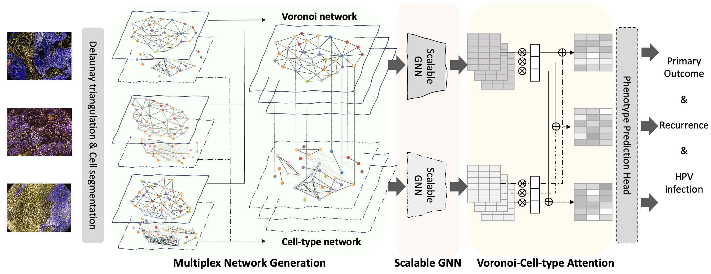

 # Mew: Multiplexed Immunofluorescence Image Analysis through an Efficient Multiplex Network

[](https://opensource.org/licenses/MIT) [](https://eccv.ecva.net/)

Official implementation for "Mew: Multiplexed Immunofluorescence Image Analysis through an Efficient Multiplex Network" accepted by ECCV 2024. Our implementation is based on [SPACE-GM](https://gitlab.com/enable-medicine-public/space-gm).

- Authors: [Sukwon Yun](https://sukwonyun.github.io/), [Jie Peng](https://openreview.net/profile?id=~Jie_Peng4), [Alexandro E. Trevino](https://scholar.google.com/citations?user=z7HDsuAAAAAJ&hl=en), [Chanyoung Park](https://dsail.kaist.ac.kr/professor/) and [Tianlong Chen](https://tianlong-chen.github.io/)
- Paper: [arXiv](https://arxiv.org/abs/2407.17857)

## Overview

Recent advancements in graph-based approaches for multiplexed immunofluorescence (mIF) images have significantly propelled the field forward, offering deeper insights into patient-level phenotyping. However, current graph-based methodologies encounter two primary challenges: (1) Cellular Heterogeneity, where existing approaches fail to adequately address the inductive biases inherent in graphs, particularly the homophily characteristic observed in cellular connectivity and; (2) Scalability, where handling cellular graphs from high-dimensional images faces difficulties in managing a high number of cells. To overcome these limitations, we introduce Mew, a novel framework designed to efficiently process mIF images through the lens of multiplex network. Mew innovatively constructs a multiplex network comprising two distinct layers: a Voronoi network for geometric information and a Cell-type network for capturing cell-wise homogeneity. This framework equips a scalable and efficient Graph Neural Network (GNN), capable of processing the entire graph during training. Furthermore, Mew integrates an interpretable attention module that autonomously identifies relevant layers for image classification. Extensive experiments on a real-world patient dataset from various institutions highlight Mew's remarkable efficacy and efficiency, marking a significant advancement in mIF image analysis. 




## **Setup**

```
conda create -n mew python=3.10 -y && conda activate mew
pip install -r requirements.txt
```

## **Dataset**

1. Please download the following raw data here: [Enable Medicine](https://app.enablemedicine.com/portal/atlas-library/studies/92394a9f-6b48-4897-87de-999614952d94?sid=1168)
- UPMC-HNC: `upmc_raw_data.zip` and `upmc_labels.csv`
- Stanford-CRC: `charville_raw_data.zip` and `charville_labels.csv`
- DFCI-HNC: `dfci_raw_data.zip` and `dfci_labels.csv`

2. After the download is complete, please locate the above files as follows:
```
dataset/
├── charville_data
    └── charville_raw_data.zip
    └── charville_labels.csv
├── upmc_data
    └── upmc_raw_data.zip
    └── upmc_labels.csv
├── dfci_data
    └── dfci_labels.csv
├── general_data
    └── upmc_raw_data.zip
    └── dfci_raw_data.zip
```

3. By running each dataset with a certain task, the preprocessing (which would take a few hours to generate graphs) will automatically happen. Finally, the preprocessed structure for charville data will be as follows:
```
dataset/
├── charville_data
    └── charville_raw_data.zip
    └── charville_labels.csv
    └── dataset_mew
        └── fig
        └── graph
        └── model
        └── tg_graph
    └── raw_data
```

## **Usage and Example**
1. Choose the data (upmc, charville, dfci) and task (classification, cox) and pass the hyperparameters. For the UPMC-HM (Hazard Modeling) task, it can be as follows:
```
python main.py \
  --data upmc \
  --task cox \
  --shared True \
  --attn_weight True \
  --lr 0.001 \
  --num_layers 1 \
  --emb_dim 256 \
  --batch_size 16 \
  --drop_ratio 0.0 \
  --device 0 
```

2. For others, please use:
- **UPMC-BC**: `sh ./sh/upmc_bc.sh`
- **UPMC-HM**: `sh ./sh/upmc_hm.sh`
- **Charville-BC**: `sh ./sh/charville_bc.sh`
- **Charville-HM**: `sh ./sh/charville_hm.sh`
- **DFCI-Generalization**: `sh ./sh/dfci_general.sh`


## Citation

```bibtex
@misc{yun2024mew,
      title={Mew: Multiplexed Immunofluorescence Image Analysis through an Efficient Multiplex Network}, 
      author={Sukwon Yun and Jie Peng and Alexandro E. Trevino and Chanyoung Park and Tianlong Chen},
      year={2024},
      eprint={2407.17857},
      archivePrefix={arXiv},
      primaryClass={cs.CV},
      url={https://arxiv.org/abs/2407.17857}, 
}
```